# MQTT/IoT DoS detection

Detects DoS activity in real MQTT traffic captured with tshark. This branch is
the DoS-only version of the project; the multi-attack version lives in
`feature/advance_model`. The agent uses a hybrid XGBoost + LSTM model and
network/transport features only; application payloads are never used for
classification.

## Architecture

Ports & Adapters with Dependency Inversion:

| Layer | Responsibility |
|---|---|
| `domain/` | Alerts, frame context, client metadata, and connection events. |
| `application/ports/` | Driven contracts: `FeatureSource`, `Classifier`, and `AlertSink`; shared `Frame` and `FeatureRow` types. |
| `application/use_cases/agent.py` | Detection use case: consumes frames, maintains 11-row windows, and emits non-normal labels. |
| `infrastructure/` | tshark capture, JSONL reading, ML models, and MQTT/file sinks. |
| `composition_root.py` | Builds and injects concrete adapters through `AgentConfig` and `build_agent`. |
| `simulation/` | External producer of normal and attack traffic. |

The agent invokes all three driven ports. `Agent.run()` is the entry point to the
use case. Domain has no infrastructure dependency, and heavy imports are lazy.

```text
simulation → Mosquitto → infrastructure.tshark.stream_features → JSONL
                                                           ↓
                                              TsharkFeatureSource
                                                           ↓
                                             Agent → Classifier
                                                           ↓
                                             AlertSink → MQTT
```

Sidecar deployment in Compose:

```mermaid
flowchart LR
    sim[simulation container] -->|MQTT publish| broker[Mosquitto container]
    broker -->|shared network namespace / eth0| cap[capture sidecar]
    cap -->|runs tshark| stream[infrastructure.tshark.stream_features]
    stream -->|writes| jsonl[(capture-data volume\nfeatures.jsonl)]
    jsonl -->|read-only mount| agent[agente container]
    agent --> source[TsharkFeatureSource]
    source --> usecase[Agent use case]
    usecase --> classifier[Classifier adapter]
    classifier --> sink[MqttAlertSink]
    sink -->|alertas/deteccion| broker
```



In Compose, `infrastructure.tshark.stream_features` runs in the `capture`
sidecar. It captures traffic from the broker's shared `eth0` namespace, writes
`/capture/features.jsonl`, and runs until the sidecar stops. `TsharkFeatureSource`
tails that file and converts each JSON record into a `Frame`; the agent never
reads packets directly.

Las ventanas se separan por conexión y dirección usando IP/puerto de ambos
endpoints y `tcp.stream` como contexto, sin cambiar las features ML. La última
predicción corresponde al frame cuyo contexto se publica en la alerta. Tras
actualizar este flujo, reconstruir y recrear `capture` y `agente`; los registros
antiguos sin `ip.dst` se omiten en modo por conexión.

Docker provides the default wiring, but capture can also run locally with tshark,
capture privileges, a valid interface, and a path shared with the agent:

```bash
python -m infrastructure.tshark.stream_features \
  --iface eth0 --filter mqtt --out /tmp/features.jsonl
```

The capture adapter is deployed with the broker network namespace and
`NET_RAW`/`NET_ADMIN` capabilities. Classifier adapters prepare features for the
exported models.

## Running

```bash
docker compose up --build  # or: podman-compose up --build
```

Compose starts certificate generation, Mosquitto, capture, the agent, and the
simulator. Set `ATAQUE` to select the simulator scenario (default: `dos`).
Esta rama admite únicamente tráfico normal (`none`) y ráfagas DoS (`dos`); ver
[simulation/README.md](simulation/README.md).

Without a broker:

```bash
python -m simulation --dry-run --ataque dos --force-attack
```

For a local run with the requirements installed and a broker available, start the
capture and agent in separate terminals:

```bash
python -m infrastructure.tshark.stream_features --iface eth0 --filter mqtt --exclude-topic alertas/deteccion --out /tmp/features.jsonl
python -c "from composition_root import AgentConfig, build_agent; build_agent(AgentConfig(capture_path='/tmp/features.jsonl', model_dir='modelos_agente', broker_host='localhost')).run()"
python -m simulation --broker localhost --port 1883 --paquetes 100 --ataque dos
```

## Models and limitations

`ml-mqtt-model.ipynb` trains only with `dataset/DoS.csv` and exports
`modelos_agente/`; `pipeline_config.json` defines the feature order. Reexport
the complete artifact package after running the notebook: the binaries already
stored in the repository predate this branch split. Do not edit model artifacts
manually. Network models do not use raw ports as features.

El notebook usa Optuna para ajustar por separado XGBoost, el autoencoder LSTM y
el XGBoost híbrido, maximizando macro-F1 únicamente sobre la partición de
validación agrupada por conexión. El test queda fuera de todos los trials y se
usa una sola vez para la evaluación final. La exportación incluye
`optuna_studies.json` con parámetros y resultados reproducibles de cada estudio.

Compose uses plaintext MQTT on port 1883. To capture TLS without decryption, use
`tcp.port == 8883`; the `mqtt` filter requires visible MQTT protocol fields.
`client_id` is currently unavailable in captured PUBLISH frames, CONNECT events
are not integrated, windows are grouped by source port, and the agent has no
dedicated CLI yet.

More detail: [simulation](simulation/README.md),
[classifiers](infrastructure/classifiers/README.md),
[sinks](infrastructure/sinks/README.md), and [broker](mosquitto/README.md).
